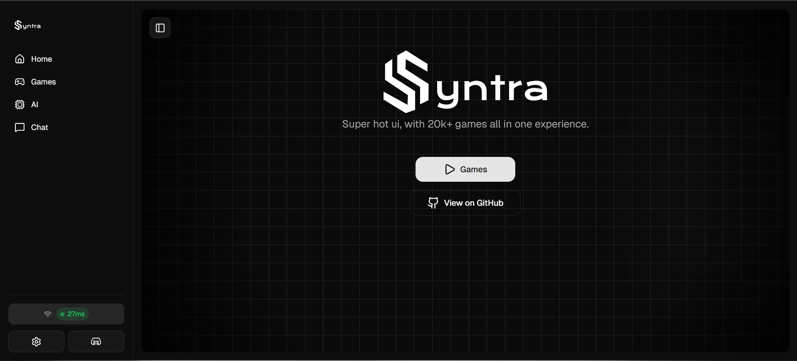

# Syntra Lite

**Syntra Lite** is a fully self-contained unblocked gaming platform offering a seamless, single-file experience. It delivers fast access to a catalog of more than six hundred games, an integrated real-time chat system, built-in AI utilities, and robust tab cloaking. Everything runs in the browser without external setup.

---

Demo:
Download singlefile.html open it and see it urself, or go to <https://outbrowsed.github.io/syntralite21k/>
---

## Features

* Single-file deployment for maximum portability
* Library of 600+ curated unblocked games
* Real-time chat embedded directly into the interface
* Built-in ai assistant for content generation and support
* Browser cloaking for platforms such as Google, YouTube, ClassLink, and others
* Multiple cloaking strategies including `about:blank` and `blob:` url injection
* Lightweight structure optimized for speed
* Continuous feature expansion

---

## Live Preview

---

## Capabilities

### Game Library

A comprehensive catalog of browser-ready titles accessible without installation.

### Communication

A live chat module enabling conversation inside the environment.

### Cloaking

Dynamic tab masking with support for common educational platforms to reduce detection.

### ai Assistance

On-page intelligent tools designed to enhance navigation and productivity.

---

## Technical Advantages

* Self-contained single asset for quick deployment
* Works on modern browsers including Chromium-based and Firefox derivatives
* Supports private or offline hosting environments

---

## License

GPL v2 © 2025 OutBrowsed
<https://www.gnu.org/licenses/old-licenses/gpl-2.0.en.html>
